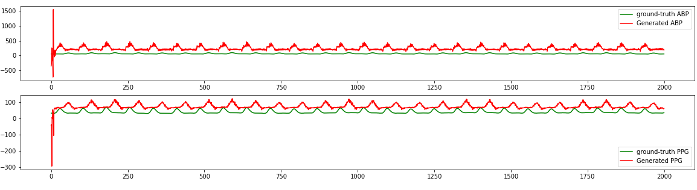
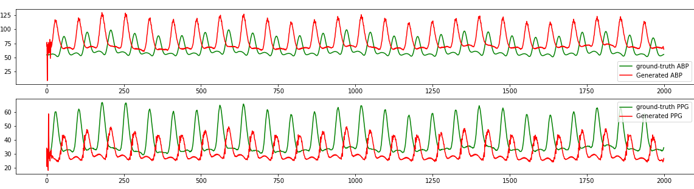
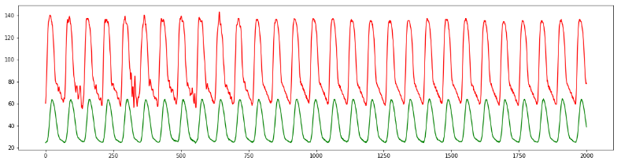
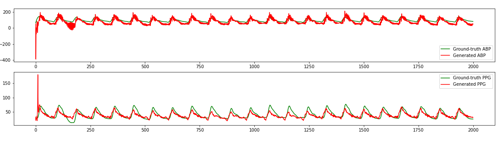
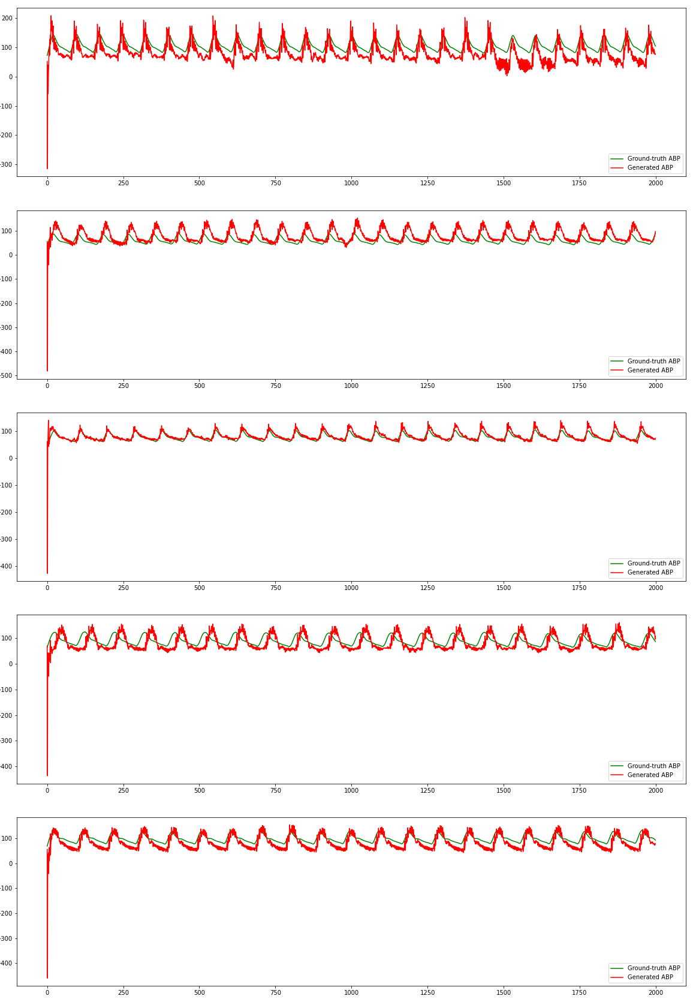
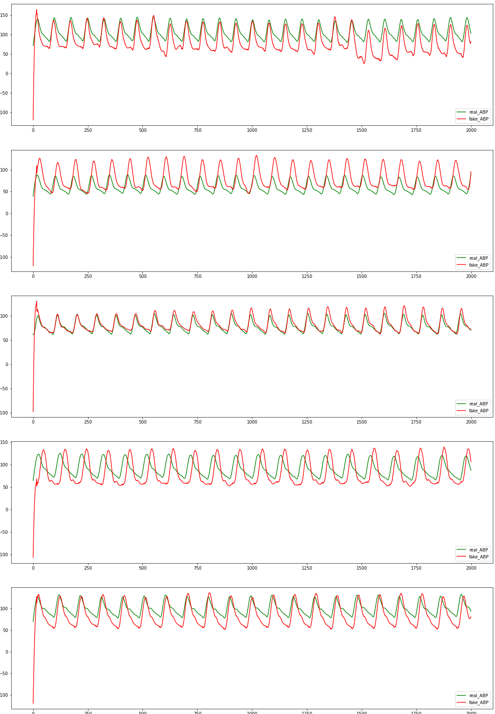

# PPG2ABP using GANs
This repository aims to research PPG2ABP using GANs.

# Terminology
<br>
|Abbreviation|Word|Meaning|
|------------|----|-------|
|BP     |Blood pressure     |Literally, blood pressure.|
|ECG    |Electrocardiogram  |ECG is the process of producing an electrocardiogram, a recording of the heart's electrical activity.|
|PPG    |Photoplethysmogram |PPG can be used to detect blood volume changes in the microvascular bed of tissue.|
|ABP    |Arterial Blood Pressure|ABP is defined as the force that is exerted by the blood on the arterial wall.|
|PTT    |Pulse Transit Time |PPT is the time taken for the arterial pulse pressure wave to travel from the aortic valve(대동맥 판막) to a peripheral site(말초).|
<br/>
<br/>

# Paper-Review 

## GANs
|Published|Paper|Journal|JIF|Authors|Links|Github|Tag|
|---------|-----|-------|---|-------|-----|------|---|
|`2014`|Generative Adversarial Nets|<i>Advances in neural information processing systems 27.</i>||Goodfellow, Ian, et al|[[Paper]](https://arxiv.org/pdf/1406.2661.pdf)<br/>[[Review]](paper-review/GAN.md)|[[Github](https://github.com/goodfeli/adversarial)]|`GAN`|
|`2015`|DCGAN - Unsupervised Representation Learning with Deep Convolutional Gnerative Adversarial Networks|<i>arXiv preprint arXiv:1511.06434.</i>||Radford, Metz, Chintala.|[[Paper]](https://arxiv.org/abs/1511.06434)<br/>[[Review]](paper-review/DCGAN.md)||`DCGAN`|
|`2018`|Pix2Pix - Image-to-Image Translation with Conditional Adversarial Networks|<i> IEEE International Conference on Computer Vision (ICCV), 2017</i>||Phillip Isola, Jun-Yan Zhu, Tinghui Zhou, Alexei A Efros|[[Paper]](https://arxiv.org/pdf/1611.07004.pdf)<br/>[[Review]](paper-review/Pix2Pix.md)|[[Github]](https://github.com/phillipi/pix2pix)|`Pix2Pix`|
|`2020`|CycleGAN - Unpaired Image-to-Image Translation using Cycle-Consistent Adversarial Networks|<i> IEEE International Conference on Computer Vision (ICCV), 2017</i>||Jun-Yan Zhu, Taesung Park, Phillip Isola, and Alexei A. Efros|[[Paper]](https://arxiv.org/pdf/1703.10593.pdf)<br/>[[Review]](paper-review/cycleGAN.md)||`CycleGAN`|


## Diffusion Model
|Published|Paper|Journal|JIF|Authors|Links|Github|Tag|
|---------|-----|-------|---|-------|-----|------|---|
|`Summary`|Diffusion Model||||[[Review]](paper-review/Diffusion_model.md)||`Diffusion Model`|

## PPP2ABP, PPG2ECG
|Published|Paper|Journal|JIF|Authors|Links|Github|Tag|
|---------|-----|-------|---|-------|-----|------|---|
|`2018`|Can Photoplethysmography Replace Arterial Blood Pressure in the Assessment of Blood Pressure?|<i>Journal of Clinical Medicine. 2018; 7(10):316.</i>|4.242|Martínez, Howard, Abbott, Lim, Ward, Elgendi|[[Paper]](https://doi.org/10.3390/jcm7100316)<br/>[[Review]](paper-review/PPGABP.md)||`PPG2ABP`|
|`2020`|PPG2ABP: Translating Photoplethysmogram (PPG) Signals to Arterial Blood Pressure (ABP) Waveforms using Fully Convolutional Neural Networks|<i>arXiv preprint arXiv:2005.01669.</i>||Ibtehaz, Rahman|[[Paper]](https://www.semanticscholar.org/paper/PPG2ABP%3A-Translating-Photoplethysmogram-%28PPG%29-to-Ibtehaz-Rahman/26238aa1d8ec51788f1b5e22aeb6ea88cac0c41f)<br/>[[Review]](paper-review/PPG2ABP_CNN.md)||`PPG2ABP` `CNN`|
|`2020`|Nonlinear Dynamic Modeling of Blood Pressure Waveform: Towards an Accurate Cuffless Monitoring System|<i>IEEE Sensors Journal, vol. 20, no. 10, pp. 5368-5378</i>||C. Landry, S. D. Peterson, A. Arami|[[Paper]](https://ieeexplore.ieee.org/document/8963724)</br>||`PPG2ECG`|
|`2021`|CardioGAN: Attentive Generative Adversarial Network with Dual Discriminators for Synthesis of ECG from PPG|<i>AAAI, vol. 35, no. 1, pp. 488-496</i>||P. Sarkar and A. Etemad|[[Paper]](https://ojs.aaai.org/index.php/AAAI/article/view/16126)<br/>[[Review]](paper-review/PPG2ECG_CardioGAN.md)||`PPG2ABP` `CycleGAN` `CardioGAN`|
|`2021`|Estimation of Continuous Blood Pressure from PPG via a Federated Learning Approach|<i>Sensors. 2021; 21(18):6311.</i>|3.576|Brophy, De Vos, Boylan, Ward|[[Paper]](https://www.mdpi.com/1424-8220/21/18/6311)<br/>[[Review]](paper-review/PPG2ABP_T2TGAN.md)|[[Github]](https://github.com/Brophy-E/T2TGAN)|`PPG2ECG` `CycleGAN` `T2TGAN`|
|`2022`|Novel Blood Pressure Waveform Reconstruction from Photoplethysmography using Cycle Generative Adversarial Networks|<i>EMBC22'(IEEE Engineering in Medicine & Biology Society (EMBC))</i>||Mehrabadi, Aqajari  Zargari.|[[Paper]](https://doi.org/10.48550/arXiv.2201.09976)</br>[[Review]](paper-review/PPG2ABP_CycleGAN.md)||`PPG2ABP` `CycleGAN`|


<br>

# Signal Processing
|Signal Processing|Note|
|-----------------|----|
|Fast Fourier Transforms|[Fast Fourier Transforms](signal-processing/Fast-Fourier-Transforms.ipynb)|
|Filter|[Bandpass Filter and Notch Filter](signal-processing/Signal-Processing-Filter.ipynb)|


<br>

# Progress
|datasets |File name|Num#|Max(PPG)|MIN(PPG)|MAX(ABP)|MIN(ABP)|
|---------|---------|----|--------|--------|--------|--------|
|20sec+100ppl+diff+matching|ppg_abp_datasets_peak_50_without_filter.npz|21791|96.8018|0.0309719|213.368|21.8015|
|20sec+100ppl+plain+matching|ppg_abp_datasets_peak_50_with_filter.npz|24137|96.8018|0.0309719|249.904|20.814|
|20sec+30ppl|ppg_abp_datasets_20_30ppl.npz|11550|96.8018|0.0309719|249.904|20.814|


## Preprocessing
1. Extracted 100 cases of PPG and ABP with 100Hz signals from vitalDB.
2. Based on the several papers, I adopted to segment the data into 20-second intervals.
3. In order to check the validity of the segment, I set the valid condition.
    <pre>
        ###########################################
        # Check the validity of the segemnt
        # Valid condition
        # (1) The length of the segment must be guaranteed to be 20 seconds.
        # (2) 0 <= PPG <= 100
        # (3) 20 <= ABP <= 250
        # (4) mstd_val(abp) > 0
        # Else, remove
        ###########################################
    </pre>
5. Here is one of the examples. 
     
6. In order to remove noise and make the wave smooth, I adopted the [Savitzky–Golay filter](https://en.wikipedia.org/wiki/Savitzky%E2%80%93Golay_filter). I applied the Golay filter into the above data. Compared to the waveform above(5), the waveform below is definitely much smoother.
     <br>
Also, here are the examples using the Golay filter with multiple window sizes [15, 21, 27, 31] <br/>
    
<br>

##### Alternate Filtering
3. I've tried to remove the noise in another way, adding addition validation condition.
    <pre>
        ###########################################
        # Check the validity of the segemnt
        # Valid condition
        # (1) The length of the segment must be guaranteed to be 8 seconds.
        # (2) 0 <= PPG <= 100
        # (3) 20 <= ABP <= 250
        # (4) mstd_val(abp) > 0
        # (5) diff(abp) < 15 and diff(ppg) < 15
        # Else, remove
        ###########################################
    </pre>
4. Even without applying the Savitzky-Golay filter, the ABP wave became softened just by adding a condition (diff(abp/ppg)<15).
5. Here is one of the examples.  </br>


<br/>
<br/>


<hr>

### Daily Note
#### Note (Update 07.06. 2022)
- GPU 문제로 colab을 사용하고 있어서, 현재 epoch 15, 30명의 환자 데이터로만 돌린 결과임.
- 
- 결과를 보았을 때, 내가 생각한 문제점은
- 첫번째, ABP의 범위가 기존 real 데이터와 비교했을 때 너무 다르다. 
- 현재 data loader 설정할 때, 논문에서 설정한 것처럼 shuffle=True로 해두었는데, 이 부분이 참 이상하다. unpaired가 학습이 잘되는게 의심스러움. shuffle=False로도 돌려보자.
- Generator에 Tanh()을 설정해놓은 상태임
- 데이터셋을 설정할 때, min-max normalization을 직접 처리했는데, 이게 Generator 모델 내의 normalization 레이어와 유사한 작업을 반복하는 것이 아닌지 확인해봐야 함.


#### Note (Update 07.07. 2022)
- colab + epoch10 + 30명의 환자 데이터 <br/>
  <br/>
- 모델 형태를 변경시켜서 격차를 어제보다는 줄어들게 만듬, 하지만 여전히 크다!
- 파일명: 02-Preprocessing_e10_30ppl_July07_0506PM.ipynb
- 어제와의 차이점
1. Generator의 첫번째 Conv 층에 Normalization과 activation 제거
    ```python
        # Initial convolution block       
        self.model1 = nn.Sequential(
            nn.ReflectionPad1d(1),
            nn.Conv1d(input_nc, 64, 3),
            #nn.InstanceNorm1d(64),
            #nn.LeakyReLU(inplace=True)
        )
    ```
2. Residual blocks의 갯수를 논문처럼 3 -> 9개로 늘림 (갯수 증가로 인해 학습시간이 epoch마다 2.5배씩 증가 (2분에서 5분))
3. loader_train, loader_test의 shuffle을 둘 다 False로 지정함.


#### Note (Update 07.08. 2022)
- colab + epoch10 + 30명의 환자 데이터 <br/>
     <br/>
- 어제와의 차이점
1. GAN LOSS 구하는 계산을 변경함 -> 데이터 범위가 유사해짐
    ```python
        # 1. GAN loss
        loss_ppg = criterion_gan(discFakeppg, real_ppg_3d)
        loss_abp = criterion_gan(discFakeabp, real_abp_3d)
    ```

#### Note (Update 07.11-12. 2022)
- colab + epoch 20 + 100명의 환자 데이터
- 어제와의 차이점
1. PPG 첫번째 peak와 ABP 두번째 peak를 매칭시킴.
    - 
    ```python
        # Check ppg peak point
        ppg = pyvital.arr.exclude_undefined(ppg)
        ppg_peaks = pyvital.arr.detect_peaks(ppg, 100) 
                
        # Check abp peak point
        abp = pyvital.arr.exclude_undefined(abp)
        abp_peaks = pyvital.arr.detect_peaks(abp, 100)
                
        # Mapping the first peak of ppg and the second peak of ABP
        try:
            pid, aid = ppg_peaks[0][0], abp_peaks[0][1]
            new_ppg = ppg[pid:pid+SEC_EXT*SRATE]
            new_abp = abp[aid:aid+SEC_EXT*SRATE]
            if len(new_ppg) != SEC_EXT*SRATE or len(new_abp) != SEC_EXT*SRATE:
                continue            
            ppg_sets.append(new_ppg)
            abp_sets.append(new_abp) 
            case_sample += 1
        except:
            continue   
    ```
2. 데이터 셋을 두가지로 만들어봄
    - PPG와 ABP에 diff를 적용 (ppg_abp_datasets_peak_50_without_filter.npz)
    - diff 대신 savgol filter 사용(ppg_abp_datasets_peak_50_with_filter.npz)

3. Filter 사용한 데이터셋 결과 20 epoch
    - 생성된 ppg와 생성된 abp <br/>
         <br/>
    - |생성된 abp 5개 출력|생성된 abp에 golay 필터 추가|
      |------------------|--------------|
      || |


#### Note (Update 07.13-14. 2022)
- colab + epoch 30 + 100명의 환자 데이터
- 어제와의 차이점
1. 모델 구조를 싹 바꿈.
    - padding 제거
    - Channel, Layer수 변경
    <code> 
    # C = Conv1d,  R = Residual Block (Conv1d x 2)
    (1) Generator(Encoder) -> C32 - C64 - C128 - C128, R128 - R128 - R128 - R128 - R128 - R128 - R128 - R128
    (2) Generator(Decoder) -> C128, C64, C32
    (3) Discriminator -> C32 - C64 - C128 - C256 - C1
    </code>

