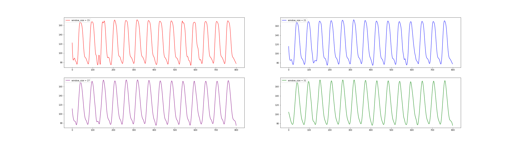

# PPG2ABP using GANs
This repository aims to research PPG2ABP using GANs.

# Terminology
|Abbreviation|Word|Meaning|
|------------|----|-------|
|BP     |Blood pressure     |Literally, blood pressure.|
|ECG    |Electrocardiogram  |ECG is the process of producing an electrocardiogram, a recording of the heart's electrical activity.|
|PPG    |Photoplethysmogram |PPG can be used to detect blood volume changes in the microvascular bed of tissue.|
|ABP    |Arterial Blood Pressure|ABP is defined as the force that is exerted by the blood on the arterial wall.|
|PTT    |Pulse Transit Time |PPT is the time taken for the arterial pulse pressure wave to travel from the aortic valve(대동맥 판막) to a peripheral site(말초).|

 

# Paper-Review 

## GANs
|Published|Paper|Journal|JIF|Authors|Links|Github|Tag|
|---------|-----|-------|---|-------|-----|------|---|
|`2014`|Generative Adversarial Nets|<i>Advances in neural information processing systems 27.</i>||Goodfellow, Ian, et al|[[Paper]](https://arxiv.org/pdf/1406.2661.pdf) [[Review]](paper-review/GAN.md)||[[Github](https://github.com/goodfeli/adversarial)]|`GAN`|
|`2015`|DCGAN - Unsupervised Representation Learning with Deep Convolutional Gnerative Adversarial Networks|<i>arXiv preprint arXiv:1511.06434.</i>||Radford, Metz, Chintala.|[[Paper]](https://arxiv.org/abs/1511.06434) [[Review]](paper-review/DCGAN.md)|||`DCGAN`|

## Diffusion Model
|Published|Paper|Journal|JIF|Authors|Links|Github|Tag|
|---------|-----|-------|---|-------|-----|------|---|
|`Summary`|Diffusion Model||||[[Review]](paper-review/Diffusion_model.md)||`Diffusion Model`|

## PPP2ABP, PPG2ECG
|Published|Paper|Journal|JIF|Authors|Links|Github|Tag|
|---------|-----|-------|---|-------|-----|------|---|
|`2018`|Can Photoplethysmography Replace Arterial Blood Pressure in the Assessment of Blood Pressure?|<i>Journal of Clinical Medicine. 2018; 7(10):316.</i>|4.242|Martínez, Howard, Abbott, Lim, Ward, Elgendi|[[Paper]](https://doi.org/10.3390/jcm7100316) [[Review]](paper-review/PPGABP.md)||`PPG2ABP`|
|`2020`|PPG2ABP: Translating Photoplethysmogram (PPG) Signals to Arterial Blood Pressure (ABP) Waveforms using Fully Convolutional Neural Networks|<i>arXiv preprint arXiv:2005.01669.</i>||Ibtehaz, Rahman|[[Paper]](https://www.semanticscholar.org/paper/PPG2ABP%3A-Translating-Photoplethysmogram-%28PPG%29-to-Ibtehaz-Rahman/26238aa1d8ec51788f1b5e22aeb6ea88cac0c41f) [[Review]](paper-review/PPG2ABP_CNN.md)||`PPG2ABP` `CNN`|
|`2020`|Nonlinear Dynamic Modeling of Blood Pressure Waveform: Towards an Accurate Cuffless Monitoring System|<i>IEEE Sensors Journal, vol. 20, no. 10, pp. 5368-5378</i>||C. Landry, S. D. Peterson, A. Arami|[[Paper]](https://ieeexplore.ieee.org/document/8963724) ||`PPG2ECG`|
|`2021`|CardioGAN: Attentive Generative Adversarial Network with Dual Discriminators for Synthesis of ECG from PPG|<i>AAAI, vol. 35, no. 1, pp. 488-496</i>||P. Sarkar and A. Etemad|[[Paper]](https://ojs.aaai.org/index.php/AAAI/article/view/16126) [[Review]](paper-review/PPG2ECG_CardioGAN.md)||`PPG2ABP` `CycleGAN` `CardioGAN`|
|`2021`|Estimation of Continuous Blood Pressure from PPG via a Federated Learning Approach|<i>Sensors. 2021; 21(18):6311.</i>|3.576|Brophy, De Vos, Boylan, Ward|[[Paper]](https://www.mdpi.com/1424-8220/21/18/6311) [[Review]](paper-review/PPG2ABP_T2TGAN.md)|[[Github]](https://github.com/Brophy-E/T2TGAN)|`PPG2ECG` `CycleGAN` `T2TGAN`|
|`2022`|Novel Blood Pressure Waveform Reconstruction from Photoplethysmography using Cycle Generative Adversarial Networks|<i>EMBC22'(IEEE Engineering in Medicine & Biology Society (EMBC))</i>||Mehrabadi, Aqajari  Zargari.|[[Paper]](https://doi.org/10.48550/arXiv.2201.09976) [[Review]](paper-review/PPG2ABP_CycleGAN.md)||`PPG2ABP` `CycleGAN`|

 

# Signal Processing
|Signal Processing|Note|
|-----------------|----|
|Fast Fourier Transforms|[Fast Fourier Transforms](signal-processing/Fast-Fourier-Transforms.ipynb)|
|Filter|[Bandpass Filter and Notch Filter](signal-processing/Signal-Processing-Filter.ipynb)|

 

# Progress

## Preprocessing
1. Extracted 500 cases of PPG and ABP with 100Hz signals from vitalDB.
2. Based on the several papers, I adopted to segment the data into 8-second intervals.
3. In order to check the validity of the segment, I set the valid condition, which yielded 43744 datasets.
    <pre>
        ###########################################
        # Check the validity of the segemnt
        # Valid condition
        # (1) The length of the segment must be guaranteed to be 8 seconds.
        # (2) 0 <= PPG <= 100
        # (3) 20 <= ABP <= 250
        # (4) mstd_val(abp) > 0
        # Else, remove
        ###########################################
    </pre>
4. Statistics
   - The number of the valid cases is 43744.
   - Maximum value of PPG is 96.8018 
   - Minimum value of PPG is 0.0309719
   - Maximum value of ABP is 249.904 
   - Minimum value of ABP is 20.814
5. Here is one of the examples. 
 
6. In order to remove noise and make the wave smooth and I adopted the [Savitzky–Golay filter](https://en.wikipedia.org/wiki/Savitzky%E2%80%93Golay_filter). Here are the examples using Golay filter with window size [15, 21, 27, 31]  
    
7. Therefore, each PPG and ABP dataset consists of the shape (43744, 800).
 

##### Update
3. I've tried to remove the noise in another way, adding addition validation condition.  which do not need to apply 
    <pre>
        ###########################################
        # Check the validity of the segemnt
        # Valid condition
        # (1) The length of the segment must be guaranteed to be 8 seconds.
        # (2) 0 <= PPG <= 100
        # (3) 20 <= ABP <= 250
        # (4) mstd_val(abp) > 0
        # (5) diff(abp) < 12 and diff(ppg) < 12
        # Else, remove
        ###########################################
    </pre>
4. Even without applying the Savitzky-Golay filter, the ABP wave became softened just by adding a condition (diff(abp/ppg)<12).
5. Here is one of the examples.   

 
 

#### Note
- Need to recheck the range of PPG and ABP
- Need to set more filters to normalize the signals.
- Need to check how to build CycleGAN model.
    - 2 Generator and 2 Discriminator

