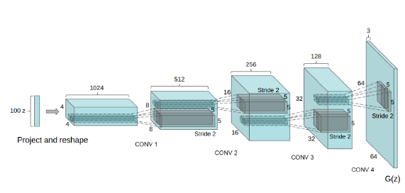

## Paper Review
<b>Title : </b> <u>Deep Convolution GAN</u> [[Paper]](https://arxiv.org/abs/1511.06434)
 
<b>Publication : 2016</b> 
 
<b>Read date : </b>: June, 21, 2022

# DCGAN
Generative adversarial networks (GANs) really began to grow after the famous paper by Goodfellow et al. in 2014. DCGAN stands for Deep Convolution GAN. DCGAN and Vanila GAN have the same setup, but the only different point is that <B>DCGAN use CNNs</B>. [[DCGAN Paper]](https://arxiv.org/abs/1511.06434)

The official GAN paper introduced Deep Neural Networks (DNNs) with dense layers only. However, DCGANs extend the idea of using <B>convolutional layers</B> both in the discriminator and the generator network.
 

## What is CNNs
CNNs stands for Convolutional Neural Networks. It is good for classifying images or detecting objects in images.
 

## The Architecture of DCGAN

1. Generator G is fed a 100-dimensional noise vector (z-latent vector) as the input. After that, we project and reshape the input.
2. We have four convolution networks.
3. Each time we get an increment in height and width. At the same time, the channels keep on reducing
4. After the first convolution operation, we have 512 output channels. This keeps on reducing with each convolution operation. Afther the third one, the output channels are 128.
5. By the end, we have a generated image of 64*64 dimentions and three output channels. 
6. Except for the first convolution layer, all the other layers have a stride of 2.

## Architectural Details of the DCGAN Model
- <b>Convolutional layers</b> 
    : The above image shows the generator network of DCGAN architecture. You can clearly see that there are no fully connected layers. We have only convolutional layers in the network.

- <b>Batch Normarlization</b> 
    : Compared to the Vanila GAN, DCGAN use <b>Batch Normalization</b>, which serves to adjust the mean and variance when the distribution of the input data of the layer is skewed. This makes it easy for backpropagation to pass through each layer, which plays an important role in helping to ensure stable learning.
- <b>No max-pooling</b>
    : DCGAN architecture is a fully convolutional network. This means that <b>we will not use any max-pooling for downsampling. All of the operations will be though strided convolutions only.</b>
- <b>Activation function</b>
    - <i>Generator</i>: We will use ReLU activation function in all the layers of the generator, except for the last one. For the last convolutional layer, we will use Tanh activation function to set the variable scope between -1 and 1.
    - <i>Discriminator</i> : We will use LeakyReLU with slope 0.2 for all the convolutional layer after applying batch normalization.
- <b>Hyperparameters</b>  
    -<i>Batch Size</i> : The author of the paper used a batch size of 128 for training DCGAN.
    -<i>Weight Initalization</i> : Initalize the weights from a zero-centered Normal Distribution with std of 0.02
    -<i>Optimizer</i> : Adam optimizer's learning rate is 0.0002. Momentum value is 0.5 instead of default value 0.9.

## Developing a GAN
- Developing a GAN for generating images requires both a discriminator convolutional neural network model for classifying whether a given image is real or generated. 
- A generator model that uses inverse convolutional layers to transform an input to a full two-dimensional image of pixel values.
 

## The aim for this code
This code aims for make new car images that realistic-looking images. 
 

## Used dataset
The dataset is [60,000+ Images of Cars](https://www.kaggle.com/datasets/prondeau/the-car-connection-picture-dataset) from kaggle.
 

## Code
|Type|Code|
|----|----|
|Pytorch|[code](https://github.com/heejipark/GAN/blob/master/DCGAN/DCGAN_Pytorch.ipynb)|
|Tensorflow|[code](https://github.com/heejipark/GAN/blob/master/DCGAN/DCGAN_Tensorflow.ipynb)|

