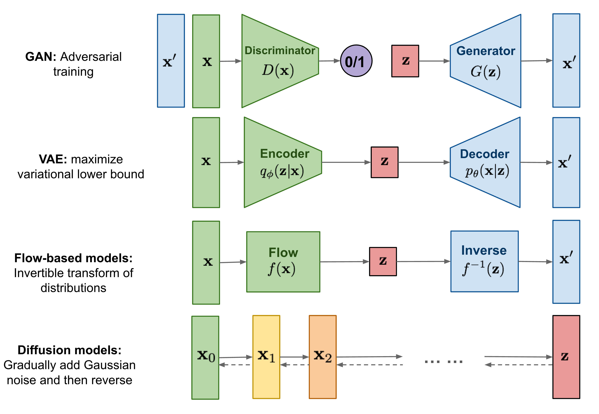

## Diffusion model이란?
Diffusion model은 열역학에서 아이디어를 가져온 모델로 크게 2단계로 나뉜다.
1. 먼저 주어진 데이터 x에 점점 noise를 추가하는데, 이 과정을 Diffusion process라고 한다. 
2. 그 다음 앞에서 정의한 Diffusion process를 reverse한 process를 계산한다. 이 과정은 noise data에서 점점 noise를 제거하는 과정이다. 딥러닝 모델을 이용해 이 reverse diffusion process를 학습하는 것으로 이 과정을 Reverse diffusion process라고 한다.

1. Diffusion process  
  
Diffusion process는 주어진 데이터 x에 time step마다 noise를 추가하는 것이다. 0 step에서 noise를 추가하면서 T step으로 가고 각 step에서 noise가 추가된 것이 latent variable zt이다. <B>Diffusion process는 지정한 noise ratio 값 beta subscript t을 time step마다 추가하는 것이고 관련된 분포를 모두 가우스분포(Gaussian distribution)로 표현할 수 있다. 여기서는 따로 학습이 진행되지 않는다.</b>
 
 

2. Reverse Diffusion process  
  
앞의 diffusion process 반대 방향의 process는 noise data에서 원래의 데이터 x로 돌아오는 과정이다. 즉 generative model이다. Diffusion process는 직접 Gaussian distribution으로 정의했지만 반대 방향인 Reverse Diffusion process를 표현하는 distribution들은 모르는 상태이다. 모델을 통해 모르는 Reverse Diffusion process를 학습하는 것이다.
 

  

## Discriminative model VS Generative model
<code>Discriminative models</code> usually predict separate quantities given the data. On the other hand, <code>Generatrive models</code> allow you to synthesize novel data that is different from the real data but still looks just as realistic.

Now, I'm going to write more detail about one of the Generative models, a Diffusion Model.

## Diffusion model
Diffusion models are inspired by non-equilibrium thermodynamics (비평형 열역학). The models define a Markov chain of diffusion step to add random noise to data and then learn the method to reverse the diffusion process in order to construct desired data samples from the noise.
Unlike VAE or flow models, diffusion models are trained with a fixed procedure and the latent variable has high dimensionality (same as the original data). [[reference]](https://lilianweng.github.io/posts/2021-07-11-diffusion-models/)  

 

### What is Diffusion Models?
Diffusion-based generative models have been proposed with similar idea, including <i>diffusion probabilistic models</i>, <i>noise-conditional score network</i>, and <i>denoising diffusion probabilistic models</i>.

### Forward diffusion
The process can be described as gradually applying Gaussian noise to the image until it becomes entirely unrecognisable. The process of noise application can be formulated as the Markov chain of sequential diffusion steps.

Let's assume that the images have a certain starting distribution q(x0). We can sample just one image from this distribution called x0. We want to perform a chain of diffusion steps x0 -> x1 -> ... -> xT, each step disintegrating the image more and more. To do this, there is a noising schedule, where for every t = 1,2,...,T.

### Reverse diffusion
To get back to the starting distribution q(x0) from the noised sample we would have to marginalize over all of the ways we could arise at x0 from the noise, including all of the latent states inbetween - ∫q(x0:T)dx1:T - which is intractable. So, if we cannot calculate it, surely we can… approximate it!

##### Good Reference
paper :
- Originally proposed in 2015 : https://arxiv.org/pdf/1503.03585.pdf

Blog: 
- https://deepseow.tistory.com/37
- https://www.assemblyai.com/blog/diffusion-models-for-machine-learning-introduction/
- https://lilianweng.github.io/posts/2021-07-11-diffusion-models/
- https://jmtomczak.github.io/blog/10/10_ddgms_lvm_p2.html
- https://towardsdatascience.com/diffusion-models-made-easy-8414298ce4da
- With pythorch code: https://www.assemblyai.com/blog/diffusion-models-for-machine-learning-introduction/

Blog in Korean:
- https://www.lgresearch.ai/kor/blog/view/?seq=190&page=1&pageSize=12
- https://developers-shack.tistory.com/8

