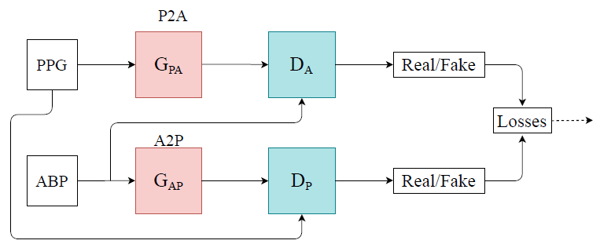
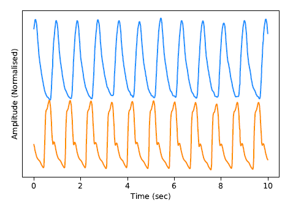
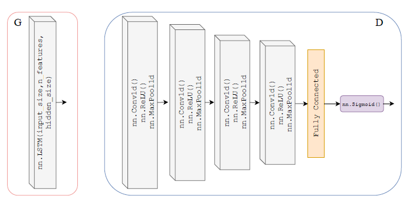
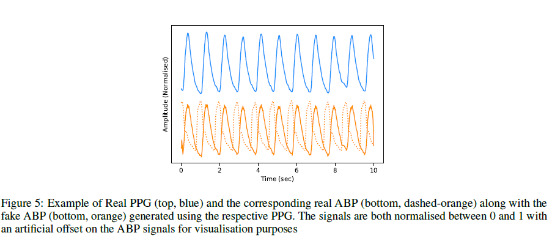
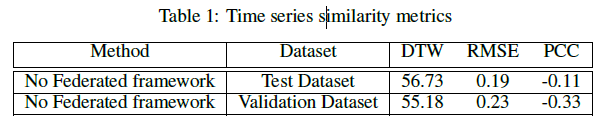

## Paper Review
<b>Title : </b> <u>Estimation of Continuous Blood Pressure From PPG via a Federated Learning Approach.</u> [[Paper]](https://arxiv.org/abs/2102.12245)
 
<b>Authors : </b> Eoin Brophy, Maarten De Vos, Geraldine Boylan, Tomás Ward
 
<b>Publication : </b> February 25, 2021
 
<b>Read by heejipark : </b>: June, 16, 2022

## Abstract
#### Object : 
ABP is a method that requires invasive and quiet high cost. Therefore, the goal of the paper is to develop a framework that is capable of inferring ABP from a single optical photoplethysmorgram (PPG) sensor alone using time series-to-time series generative adversarial network (T2TGAN). 
#### Result:
T2TGAN is capable of high-quality continuous ABP generation from a PPG signal with a mean error of 2.54mmHg and a standard deviation of 23.7mmHg.

## 1. Introduction
Methods for non-invasively measuring continuous ABP
- Pulse Transit Time (PTT) : is the time-interval taken for a pulse wave to travel between two arterial sites. PTT is defined as the difference in the R-wave interval of an ECG signal, which information is captured from a PPG signal.

- Why we adopt PPG?  
PPG is a devices that requires a single sensor and works by LEG into microvascular, measuring the amount of reflected/transmitted and absorbed light via photo-sensor and detecting the volume changes of blood over the cardiac cycle. By using the output from this sensor, we can determine a valid heart rate. 

## 2. Related Work
- Slapniˇcar et al. implemented a spectro-temporal deep neural network (DNN) to model the dependencies that exist between PPG and BP waveforms.
- El Hajj and Kyriacou implement recurrent neural networks (RNNs) for estimation of BP from PPG only.
- Ibtehaz and Rahman presented their PPG2ABP method that utilises a deep-supervised U-Net model that consists of an encoder and decoder network adopted for regression.
- Sarkar and Etemad present their model CardioGAN that employs an adversarial training method to map PPG to ECG signals.
- This paper implements a LSTM-CNN GAN model that is capable of generating continuous BP from a given PPG signal.

## 3. Methodology

The authors design a T2T-GAN(Time series to Time series Generative Adversarial Network) model based on CycleGAN which is cpable of unpaired image-to-image translation.
The T2T-GAN can translate from one time series modality to another usiing cycle-consistency losses.

P2A stands for the generator transform function from PPG to ABP. Conversely, A2P stands for ABP to PPG.

#### (1) Computing Platform
- Pytorch
- Google colab

#### (2) Dataset
Example of Real PPG(top,blue) and ABP(bottom, orange) data.

 
1. Train dataset : "Cuff-Less Blood Pressure Estimation"
    - ECG, PPG, ABP 125Hz signals
    - Used first 5 records and segmented them into 8-second intervals, which yieled 144000 training set (320 hours)
    - Used last 2 records into 55000 validation samples (122 hours)
    - [144000, 2, 1000] dimensional vector 
2. Test dataset : "University of Queensland vital signs dataset: development of an accessible repository of anesthesia patient monitoring data for research"
    - PPG, ABP 100 Hz signals
    - Used Case 5 and segment the data into 10-second, which yields an [900, 2, 1000] (150 minutes)
    
#### (3) Model
- Generator and Discriminator architecture
- Generator

|Structure|Val|
|---|---|
|Model|CycleGAN for time series data|
|Layer type|Two layer(Gpa and Gap) - LSTM|
|Layer|50 hidden units in each layer   Fully connected layer at the output|
|Input Size|1000|
|Activation Function|ReLu + Linear|

- Discriminator

|Structure|Type|
|---|---|
|Model|U-Net|
|Layer type|4-layer 1-dimensional CNN|
|Layer|Fully connected layer|
|Activation Function|Sigmoid|

#### (4) Training
- Used distributed 20-client-models for training.

#### (5) Evaluation
- Used the mean arterial pressure (MAP) of generated samples as a evaluation indicator.
- Compare true MAP measurments from the real ABP signal to calculated MAP from generated ABP by T2TGAN model. 
- Quantity evaluation: Also used DTW(dynamic time warping), RMSE(root-mean-squared error) and PCC(Pearson Correlation Coefficient algorithms) as distance and similarity measures between real and generated time series BP sequence.

## 4. Result

Quantity evaluation: 

## 5. Conclusion
- Results of a mean error of 2.54mmHg standard deviation of 23.7mmHg do not meet the AAMI criterion

 

---

##### Unknown words in the paper
- ischemic heart disease : 국소빈혈성 심장질병
- strain : 부담, 중압감, v.(근육 등을)혹사하다, 안간힘을 쓰다
- sphygmomanometer : 혈압계 (for BP - short time안에 구할 수 있음) 
- arterial catheter : 동맥압 카테터 (주사기 팔에 꼽고 동맥압 검사 - invasive method but can know continuous BP measurement)
- finapres : 피나프레스 장치 (continuous and unobtrusive BP수단이나 개개인의 continuous BP를 집에서 구할만한 도구는 아님.)
- unobtrusive : 불필요하게 관심을 끌지 않는, 지나치게 야단스럽지 않은
- cardiovascular : 심혈관의

