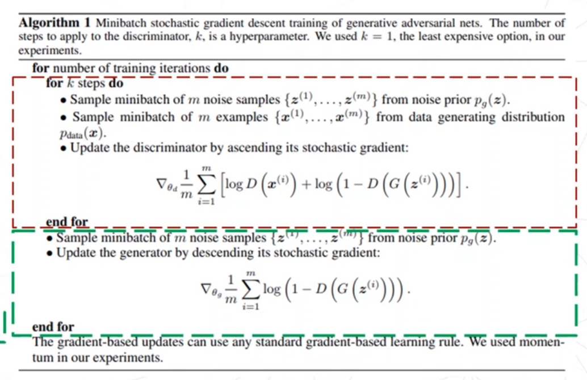
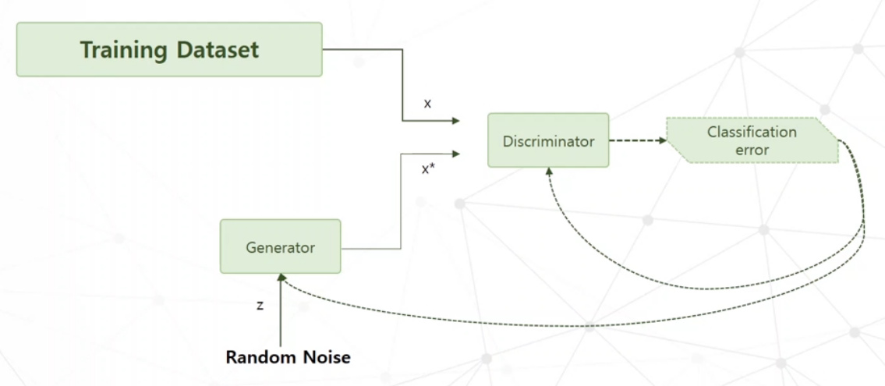
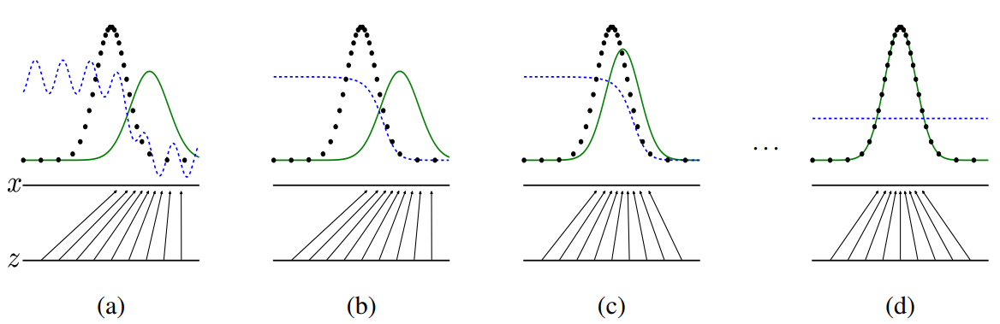

## Paper Review
<b>Title : </b> <u>Generative Adversarial Nets</u> [[Paper]](https://arxiv.org/pdf/1406.2661.pdf)
 
<b>Authors : </b>  Goodfellow.,
 
<b>Publication : </b> 2014
 
<b>Read date : </b>: June, 20, 2022

# GAN (Generative adversarial network)
** This repository aims to study a Generative adversarial network (GAN) using Pytorch as well as Tensorflow.

 

## 1. What is GAN?
The primary objective of the Generative Model is to learn the unknown probability distribution of the population from which the training observations are sampled. Once the model is successfully trained, you can sample new, “generated” observations that follow the training distribution.
  
Developing a GAN for generating images requires both a discriminator convolutional neural network model for classifying whether a given image is real or generated and a generator model that uses inverse convolutional layers to transform an input to a full two-dimensional image of pixel values.

 

## 2. Sudo Code from official GAN paper [[Paper]](https://arxiv.org/pdf/1406.2661.pdf)

The above sudo-code are represented in the official GAN paper 'Generative Adversarial Networks,' written by Ian J. Goodfellow(2014). 

In this sudo-code, the training process will be divided at two parts. The red box refers to <code>Discriminator(D)</code>, and the green box refers to <code>Generator(G)</code>.

 

## 3. GAN structure

### (1) Training the discriminator
1. Each training iterate that taking a random real example x from the training dataset and then label x as 1.
2. Get a new random noise vector z and using the Generator network, use it to get (= synthesize) a fake example x*. And then, label the fake example as 0 because they are drawn from the fake distribution.
3. Then, Use the Discriminator network to classify the real data x and the fake data x*.
4. Compute the classification error and backpropagate the total error <b>to update the Discriminator weights and biases</b>, <b>so as to minimize the classification errors.</b>
- During the discriminator training, the discriminator ignores the generator loss and just uses the discriminator loss. 
- Also, the generator should be constant during the discriminator training phase.

### (2) Training the Generator
1. Get a new random noise vector z and using the Generator network, use it to get (= synthesize) a fake example x*. We should set the label as 1 to delude(=deceive) the Discriminator.
(We could say that Generator is pretending that this image is real. Such that this image should be classified as the real one by Discriminator.)
2. Use the Discriminator network to classify the fake data x*.
3. Compute the classification error and backpropagate the total error <b>to update the Generator weights and biases</b> (= to synthesize the fake data example), <b>so as to maximize the Discriminator's error.</b>  
- In order to get feedback from Discriminator, backpropagate through both the discriminator and generator to obtain gradients. 
- We use gradients to change only the generator weights. 
- The discriminator should be constant during the generator training phase.

#### Keep in mind! 
- The Generator should be constant during generator training. 
- The Discriminator should be constant during discriminator training.
- Otherwise, the training process makes issues, and model convergence cannot work.

### (3) Detail of GAN training

In this image from the official paper, we will see how the Latent variable after several iterations becomes a probability distribution. And, we could say that both the Discriminator and Generator reach out Nash equilibrium, which means GAN is fully trained. Once the training is completed, we can get a Generator model that can produce realistic-looking images.

 

## 4. Math in GAN
#### How to identify the similarity between two probability distributions
- Kullback-Leibler divergence (KL divergence) 
: It measures how one probability distribution p diverges from a second expected probability distribution q. [[wiki]](https://en.wikipedia.org/wiki/Kullback%E2%80%93Leibler_divergence)

- Jensen-Shannon divergence = The information radius (IRaD) = The total divergence to the average
: It measures the distance between two probability distributions. [[wiki]](https://en.wikipedia.org/wiki/Jensen%E2%80%93Shannon_divergence)

- Minmax objective function [[wiki]](https://en.wikipedia.org/wiki/Minimax#:~:text=Minimax)

 

## 5. Types of GAN

|Type|Description|More|Code|
|----|-----------|----|----|
|DCGAN|DCGANs extend the idea of using convolutional layers both in the discriminator and the generator network.|[[DCGAN Detail](https://github.com/heejipark/Research-PPG2ABP-using-GAN/blob/master/paper-review/DCGAN.md)]|[[Pytorch]](https://github.com/heejipark/GAN/blob/master/DCGAN/DCGAN_Pytorch.ipynb)  [[Tensorflow]](https://github.com/heejipark/GAN/blob/master/DCGAN/DCGAN_Tensorflow.ipynb)|
|WGAN|Replace the binary classification in the discriminator with the Wasserstein distance to alleviate mode collapse and vanishing gradient in GAN|||
|Pix2Pix|Image to Image translation with paired data|||
|CycleGAN|Image to Image translation with unpaired data|||
|SeqGAN|Generate sequences with discrete variates using Reinforce algorithm and policy gradient|||
|TimeGAN|Jointly training with a GAN loss, a reconstruction loss, and a sequential prediction loss.|||
