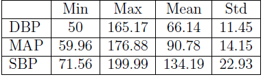
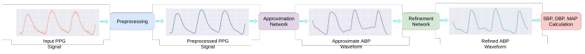
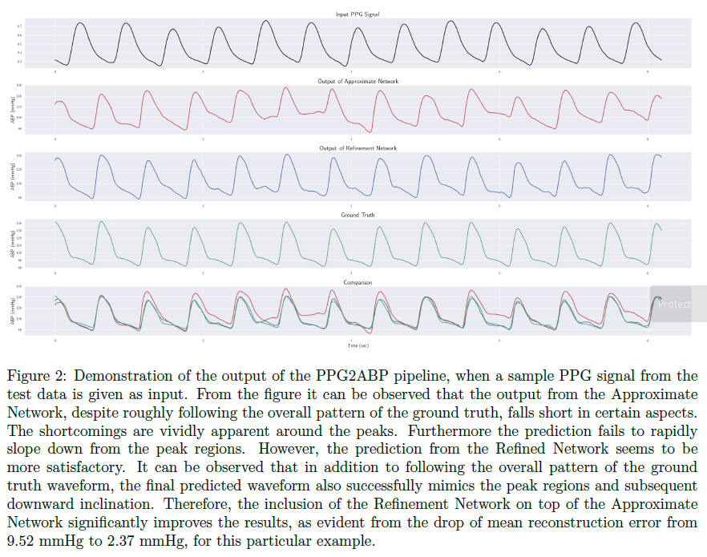
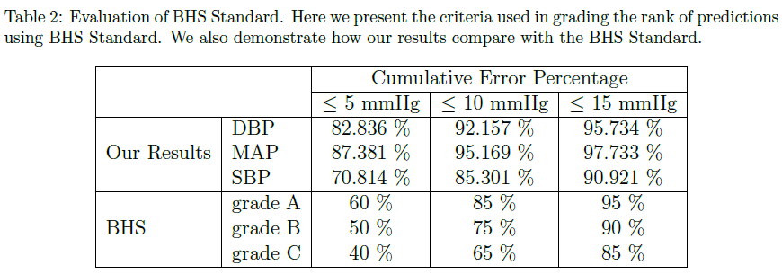
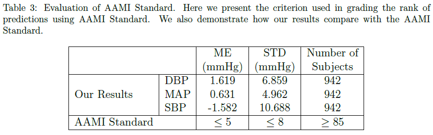
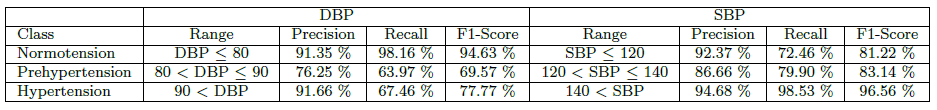
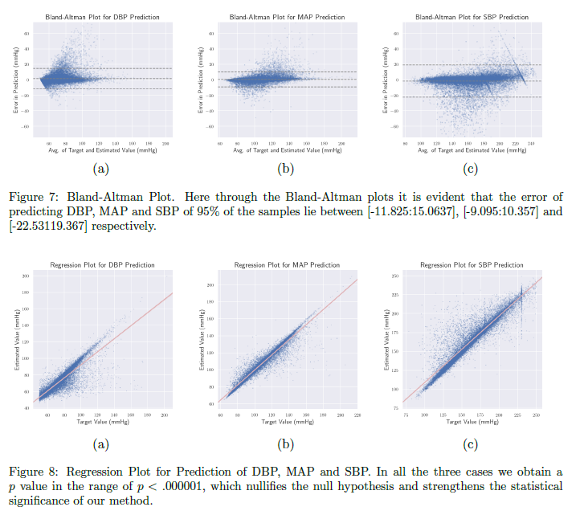

## Paper Review
<b>Title : </b> <u>PPG2ABP: Translating Photoplethysmogram (PPG) Signals to Arterial Blood Pressure (ABP) Waveforms using Fully Convolutional Neural Networks</u> [[Paper]](https://arxiv.org/abs/2102.12245)
 
<b>Authors : </b> Nabil Ibtehaz, M. Sohel Rahman
 
<b>Publication : </b> May 5, 2020
 
<b>Read by heejipark : </b>: June, 15, 2022

## Abstract
#### Object 
Cardiovascular diseases(CVD) is one of the most severe causes of mortality. In order to reduce an invasive process for monitoring the patient's status, this paper presented the method to predict the continous arterial blood pressure (ABP) waveform via a non-invasive approach using photoplethysmogram (PPG) signals.
#### Result:
The result of the model shows the PPG with a mean absolute error of 4604 mmHg, maintaining the shape, magnitutde and phase in unision.
#### Note:
computed values of DBP, MAP and SBP from the predicted ABP waveform shows more great performance rather than the exdisting works.

## 1. Introduction
Phtoplethysmography (PPG) signal has bee being used for measurement of blood pressure. Its principle of mesurement is to detect the light absorption of skin and keep track of how mush light is reflected, which is the volume of blood flowing.

## 2. Materials and Methods
#### (1) Dataset
- Physionet's MIMIC II dataset (Multi-parameter Intelligent Monitoring in Intensive Care) in the UCI Machine Learning Repository (https://archive.ics.uci.edu/ml/datasets/Cuff-Less+Blood+Pressure+Estimation).
- Both PPG and ABP signals are 125Hz, 8-bit precision
- DBP ~ 50 mmHg and SBP ~ 200 mmHg  

- Used and predicted signal episodes of 8.192 seconds long
- Total 1024 samples

#### (2) Proposed Methodology
- PPG2ABP takes a PPG signal of Te seconds long, preprocessing attenuate the irregularities and noises
- Using Approximation Netwrok, filtered the signal.
- The Refinedment Network refined the overall waveform approximation
- SBP, MAP and DBP can be computed using ABP wavefrom.

#### (3) Preproscessing
Used preprocessed data from Physionet's MIMIC II dataset.

#### (4) Approximation Network
Approximation Network is a one-dimensional deep supervised U-Net model which only consists of convolutional layers. U-Net is constructed using a symentric pair of Encoder Network and Decoder Network. The Encoder extracts spatial features from the input and the Decoder produce the segemtation map using the features. The paper used U-Net to perform regression based on one-dimensional signals instead of performing semantic segmentation on images. All the convolutional layers used ReLu function except the final layer and are batched normalized. The final layer used a linear activation function.

|Structure|Type|
|---|---|
|Model|U-Net|
|Layer type|Convolutional layer|
|Constructure|Encoder + Decoder|
|Dimention|One-dimensional signals|
|Activation Function|ReLu + Linear|

#### (5) Refinement Network
Sometimes, there is outlier from the output of the Approximation Network. Therefore, the authors use improved version of the U-Net called 'MultiResUNet', which includes MultiRes blocks and Res paths in some cases. The other conditions including the number of layer and the activation fuctions are the same.

#### (6) SBP DBP calculation
For interest, the writers compute the values of SBP, DBP and MAP using below formula.
    - SBP = max(ABP)
    - DBP = min(ABP)
    - MAP = mean(ABP)
Note that the above-mentioend ABP value is predicted from PPG2ABP model.

## 3. Experiments
#### (1) Selection of Models
- U-Net - used as Approximation Network
- MultiResUNet - used as Refined Netwrok
- SegNet (low accuracy)
- FCNN (low accuracy)
#### (2) Selection of Loss Function
- MAE (Mean Absolute Error) - selected
- MSE (Mean Squared Error) (low accuracy)

#### (3) Effect of Number of Convolution Filters
- Trade-off (high performance vs computational cost)
- The number of folters as multiple of 64 for the U-Net.
- The value of alpha is 2.5 for the MultiResUNet.

#### (4) Effect of Deep Supervision
Because of computational cost, the authors use the deep supervision only for U-Net model

#### (5) Training Methodology
- Optimizer: Adam 
- 100 epochs

#### (6) K-Fold Cross Validation
- 10-fold corss validation
- The ratio of 'train : validation' = 90 : 10

## 4. Result
#### (1) Predicting ABP Waveform
- Closely follows the ground truth waveform of the arterial blodd pressure. From experimental results it is evident that PPG2ABP can translate PPG signals to corresponding blood pressure waveforms, preserving the shape, magnitude and phase in unison.

- Quantitatively, the mean absolute error of this blood pressure waveform construction is 4:604 +- 5:043mmHg over the entire test dataset. In addition, the mean absolute error of DBP, MAP and SBP prediction is 3:449 +- 6:147mmHg, 2:310 +- 4:437mmHg, and 5:727+-9:162 mmHg respectively.
- Revise existed phase lag between PPG and ABP signals of MIMIC Database

#### (2) Inappropriate Signals
PPG signals get easily corrupted by different types of artefacts. Moreover, cleansing PPG signals of these anomalies is challanging. Also, in this paper, the authors established the metric to measure the skewness based quality index.
    
#### (3) BHS Standard
The British Hypertension Society (BHS) has introduced a structured protocol to assess blood pressure measuring devices and methods.

#### (4) AAMI Standard
The criterion set by AAMI standard requires the blood pressure measuring methods to have a mean error and standard deviation of less than 5 mmHg and 8 mmHg respectively.

#### (5) BP Classification Accuracy

#### (6) Statistical Analyses

## 5. Application
Predicting the typical systolic and diastolic blood pressure values, etc.

 

---

##### Unknown words in the paper

- menacing causes: 위협적인 원인
- morbidity = mortality : 사망률
- cardiovascular disease : 심혈관 질병
- hypertension : 고혈압
- catheter-based approach : 도관 기반 접근법
- Hyperemia : 충혈
- versatile : 다재다능한
- attenuate : 약화시키다. 희석시키다
- denoising : 잡음제어
- negate : 무효화하다
- auxiliary : 보조의
- ECG : 심전도 = Electrocardiogram (ECG) is a simple test that can be used to check your heart's rhythm and electrical activity. Sensors attached to the skin are used to detect the electrical signals produced by your heart each time it beats.

