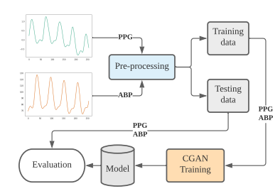
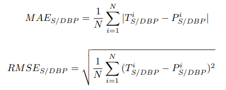
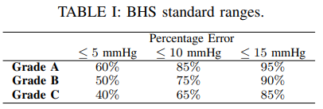
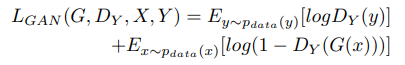
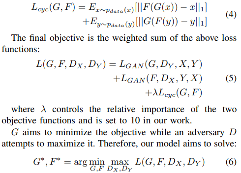
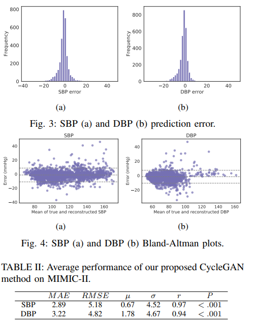
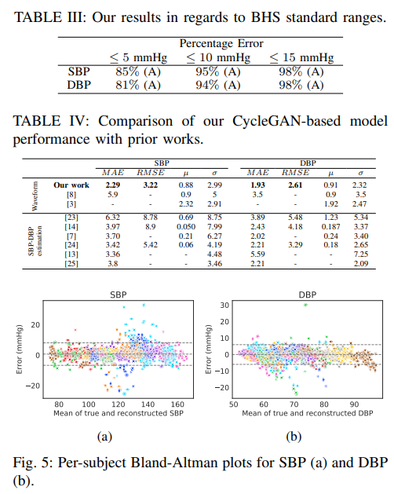

## Paper Review
<b>Title : </b> <u>Novel Blood Pressure Waveform Reconstruction from
Photoplethysmography using Cycle Generative Adversarial Networks</u> [[Paper]](https://arxiv.org/pdf/2201.09976.pdf)

 
<b>Authors : </b> Milad Asgari Mehrabadi, Seyed Amir Hossein Aqajari, Amir Hosein Afandizadeh Zargari, Nikil Dutt, Amir M. Rahmani
 
<b>Publication : </b> Jan 24, 2022
 
<b>Read date : </b>: June, 24, 2022

## Abstract
#### Object 
The paper propose a CycleGAN based approach to extract a BP signal known as ABP from a clean PPG signal.

#### Result:
THe performance of the model the paper used outperforms rather than previous research.

#### Note:
up to X2

## 1. Introduction
In this paper, the authors propose the model based on Cycle GAN to reconstruct the entire ABP waveform using a PPG signal. 

- Used 5 cross-fold validation with 90 subjects
- Achieved prediction error (MAE ± σ) of 2.89 ± 4.52 mmHg and 3.22 ± 4.67 mmHg for SBP and DBP, respectively.
- Per-subject evaluation achieved (2.29 ± 0.88 mmHg for SBP and 1.93 ± 2.61 mmHg for DBP).  

## 2. Related Works
- Many works tried to extract SBP and DBP using ECG or PPG. 
- There are few studies on BP waveform reconstruction.

## 3. Material and Methods
### (1) Dataset
- 125 Hz
- Used 5 mins of recording for 92 subjects 
    - 72 ppl for training (6 hours)
    - 17 ppl for testing  (1.42 hours)
- 5-cross fold validation

### (2) Pre-processing
- Eliminate Noise : Fourier Transform (FFT) approach
- Band-pass filter with cutoff frequencies of 0.1 and 8Hz to remove noises from the PPG.
- Low-pass filter with cutoff frequency of 5Hz to clean the ABP signal.
- For both PPG & ABP, normalize the values of the signals. 
- Afterward, each signal is divided into windows of 256 samples with 25% overlap for the downstream learning task using CycleGAN.

### (3) Evaluation metrics
- Mean Absolute Error (MAE)
- Root Mean Square Error (RMSE)  

- British Hypertension Society (BHS) guidelines 

### (4) PPG to ABP translator (PAT)
- Used CycleGAN

> What is CycleGAN?
>> - CycleGAN is powerful tools for signal-to-signal translation
>> - CycleGAN consists of two generators and two discriminator networks working in pairs.
>> - CycleGAN is to take data from the first domain as an input and genrate data for the second domain as an output, and vise versa.

> CycleGAN in this paper
>> - In this paper, the mapping between PPG signals (domain x) and ABP signals (domain Y) are needed.
>> - Two generator with mapping (X->Y) and (Y->X).
>> - Two discriminators with Dx(=distinguish btw real PPG and generated PPG), and Dy(=distinguish between the real ABP and the generated ABP)
>> The losses are used to match the distribution of the synthetic signals to the data distribution of the original signals. They are applied to both mapping functions (G: X->Y and F:Y->X).
>> The object of the mapping function G as a generator and its discriminator Dy is expressed beflow. 
    
>> Distributions' loss is expressed as L(F,Dx,Y,X)
    >> The adversarial losses as the final objective loss function are not sufficient enough to gurantee that the learned functions can translate an individual input from the first domain into a desired output in the second domain. 
    >> Therefore, <b>cycle consistency losses </b>are added to the final objective loss function in order to gurantee the mapping from an individual input(xi) to a desired output(yi) by considering learned mapping functions to be cycle consistent.
    >> - Cycle consistency means for each PPG signal x from domain X, we must have <b>x -> G(x) -> F(G(x)) ~ x</b>.
    >> - While for each ABP signals y we have, <b> y -> F(y) -> G(F(y)) ~ y</b>.
    >> The cycle consistency behavior is indicated as :
      

### (5) Structure
- Generative networks 
    - Used CycleGAN with stride-2 convolutions, 9 residual blocks, two fractionally-stride convolutions with stride 0.5

- Discriminator
    - 70 X 70 PathGANs to classify whether the siganls are fake or real.

## 4. Experimental Results
- Pass all the criteria of BHS metrics.  
- The model outperforms the studies with waveform reconstruction as well as those with only SBP-DBP values estimation.
  

## 5. Conclusion
- First user
- The model used in this paper achieved MAE of 2.89 mmHg and 3.22 mmHg for SBP and DBP in a cross-subject setting. 
- The per-subject evaluation’s performance was 2.29 mmHg for SBP and 1.93 mmHg for DBP, outperforming state-of-the-art approaches by up to 2×.

