## Paper Review
<b>Title : </b> <u>CardioGAN: Attentive Generative Adversarial Network with Dual Discriminators for Synthesis of ECG from PPG</u> [[Paper]](https://ojs.aaai.org/index.php/AAAI/article/view/16126)
<br>
<b>Authors : </b> Sarkar, P., & Etemad, A. 
<br>
<b>Publication : </b> May 18, 2021
<br>
<b>Read date : </b>: July, 01, 2022

## Abstract
#### Object : 
- The authors propose CardioGAN, which takes PPG as input and generates ECG as output. 
- CardioGAN consists of an attention-based generator to learn local salient features and dual discriminators to preserve the integrity of generated data in both time and frequency domains.


#### Result:
- ECG generated by CardioGAN provide more reliable heart rate measurements compared to the original input PPG. 
- Reduce the error from 9.74 beats per minute (measured from the PPG) to 2.89 (measured from the generated ECG).


## 1. Introduction
- CardioGAN is for generating ECG signals from PPG inputs. 
- Used attention mechanism in the generators to better learn to focus on specific local regions such as the QRS complexes of ECG.
- Used attention-based generators and dual time and frequency domain discriminators.
- Result 1: The generated ECG outputs are very similar to the corresponding real ECG signals.
- Result 2: The researchers perform HR estimation using the generated ECG and the input PPG signals, whish leads to getting more accurate HR estimation.

## 2. Related Work
- Generating ECG Signal
- ECG Syntesis from PPG

## 3. Method
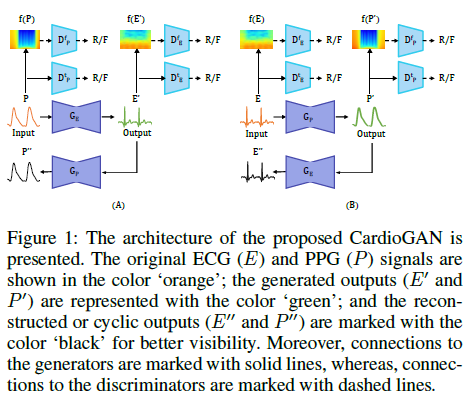

### 3-1. Architecture
- Mapping between PPG(P) and ECG(E) domains.
- Used an attention mechanism into the generator in order to force the generator to focus on regions of the data.
```python
    GE : P -> E       # in order to learn mappint (PPG, ECG)
    GP : E -> P       # in order to learn mappint (ECG, PPG)
    We denote the generated ECG from CardioGAN as E' (E' = GE(P))
    We denote the generated PPG from CardioGAN as P' (P' = GP(E))
    Dt is used to classify time domain  # E VS E'
    Df is used to classify frequency domain  # P VS P'
```

### 3-2. Dual Discriminators
Perform Short-Time Fourier Transformation(STFT) on the ECG.PPG time series data in order to leverage the concept of dual discriminators.

### 3-3. Attention-based Generators
Adopt Attention U-Net architecture as a generator.

### 3-4. Loss
Combination of an adversarial loss and a cyclic consistency loss

#### (1) Adversarial Loss
- Apply adversarial loss in both forward and inverse mappings.
- Let's denote individual PPG segments as p and the corresponding ground-truth ECG segments as e. 
- For the mapping function GE: P->E, and discriminators DE(t) and DE(f), the adversarial losses are defined as: <br/>
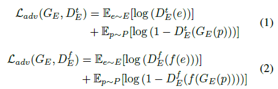<br/>
- For the mapping function GP: E->P, and discriminators DP(t) and DP(f), the adversarial losses are defined as: <br/>
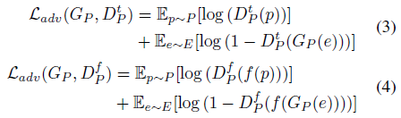<br/>
- Finally, we can get <br/>
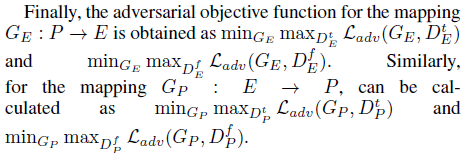<br/>

#### (2) Cyclic Consistency Loss
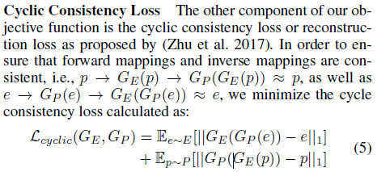

#### (3) 


Final Loss
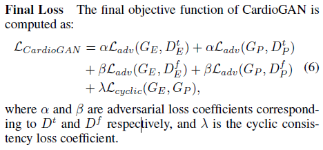

## 4. Experiments

### 4-1. Datasets
Combined ECG-PPG datasets from BIDMC, CAPNO, DALIA, WESAD.

### 4-2. Data Preparation
- (Both) 128 Hz ECG and PPG
- (ECG) Apply a band-pass FIR filter with pass-band frequency of 3 Hz
- (ECG) Apply a stop-band frequency of 45 Hz
- (PPG) Apply a band-pass Butter-worth filter with a pass-band frequency of 1 Hz
- (PPG) Apply a stop-band frequency of 8 Hz
- (Both) z-score normalization is performed on both ECG and PPG
- (Both) are segmented into 4-second windows (128 Hz X 4 seconds = 512 samples), with a 10% overlap to avoid missing any peaks.
- (Both) min-max [-1, 1] normalization

### 4-3. Architecture
#### (1) Generator
- Attention U-Net
- GE and GP take 1x512 data points as input
- Encoder consists of 6 blocks, where the number of filters is gradually increased (64, 128, 256, 512, 512, 512) with a fixed kernel size of 1 x 16 and stride of 2. And apply layer normalization and leaky-ReLu activation after each convolution layers except the first layer, where no normalization is used.
- Decoder also have same architecture, except de-convolutional layers with ReLu. Compared to Encoder, Decoder consists of the filters, which is gradually decreased in the same manner. The final output is obtained from a de-convolutional layer with a single-channel output followed by tanh activation.

#### (2) Discriminator
- Dual discriminators are used to classify real and fake data in time and frequency domains.
- DE(t) and DP(t) take time-series signals of size 1x512 inputs
- DE(f) and DP(f) take time-series signals of size 128x128 inputs
- Both D(t) and D(f) use 4 convolution layers where filters are gradually increased (64,128,256,512) with a fixed kernel of 1x16 with stride of 2 for D(t) and 7x7 with stride of 2 for D(f).
- normalization and leakyReLu except first layer
- output is obtained from single-channel CNN
- <b>To train in unpaired fashion, suffle the ECG and PPG segments from each dataset, eliminating the coupling between ECG and PPG</b>


### 4-4. Training
- 8:2 = Train:test
- Batch size: 128
- Adam optimizer
- 15 epochs
- Learning rate:  1e(-4) for 10 epochs, then linearly decayed to 0

## 5. Performance
Produces two main signal outputs, generated ECG (E') and generated PPG (P').

### 5-1. Quantitative Result
#### (1) Mean absolute error (MAE) metric for the heart rate (in BPM) obtained from a given ECG or PPG signal (HRQ)
- The results are presented in Table 1 where we observe that for 3 of the 4 datasets, the HR measured from the ECG generated by CardioGAN is more accurate than the HR measured from the input PPG signals. <br/>
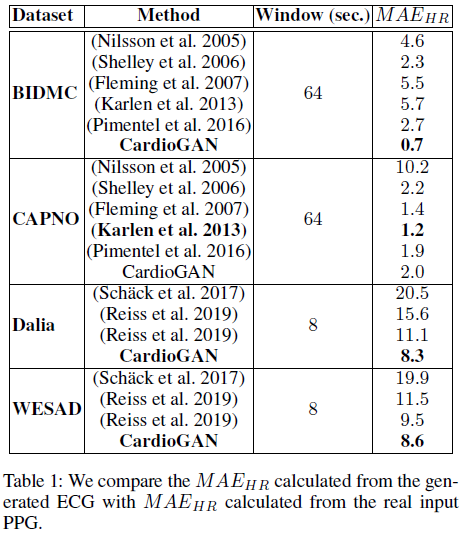 <br/>
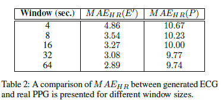 <br/>

### 5-2. Qualitative Results
In some cases, the generated ECG signals exhibit a small time lag with respect to the original ECG signals. The root cause of this time delay is the Pulse Arrival Time (PAT), which is defined as the time taken by the PPG pulse to travel from the heart to a distal site. <br/>
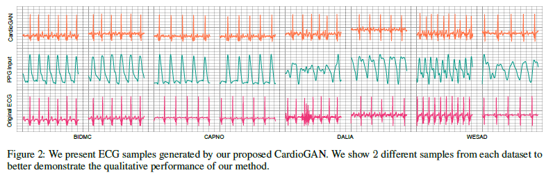 <br/>


### 5-3. Ablation Study
#### (1) Different Model Architecture
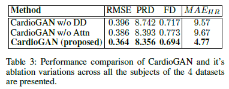 <br>

#### (2) Unpaired Training vs Paired Training
- <b>Unpaired training of CardioGAN shows superior performance compared to paired training. </b> In particular, CardioGAN-Paired does learns well to generate ECG beats from PPG inputs, but it fails to learn the exact shape of the original ECG waveforms.
- The researcher assumes that this might be because an unpaired training scheme forces the network to learn stronger userindependent mappings between PPG and ECG. However, <i>utilizing paired data using other GAN architecture might perform well.</i>
- The result of Paired training below <br>
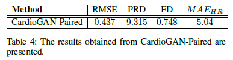 <br>
