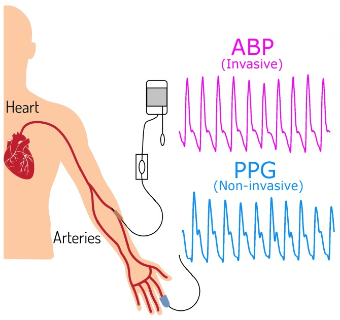
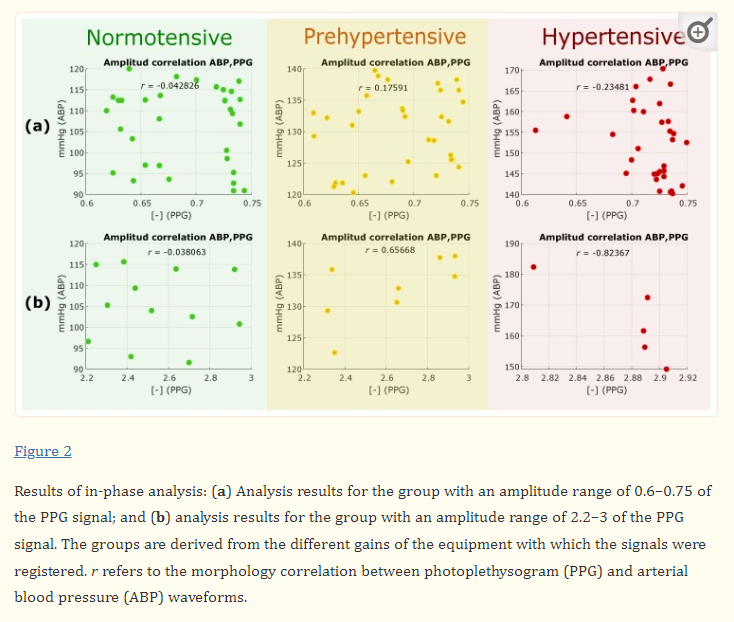
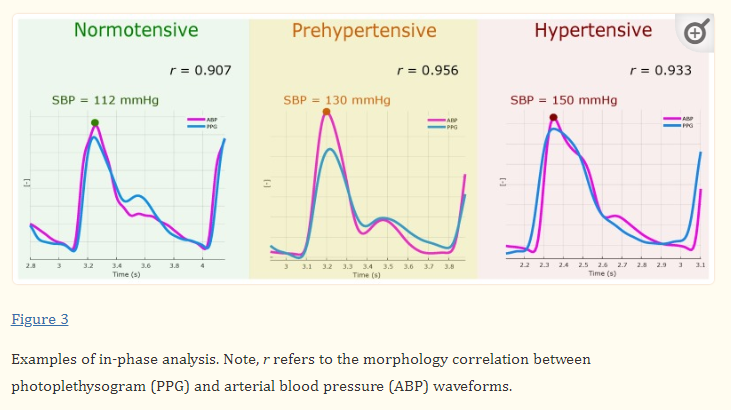
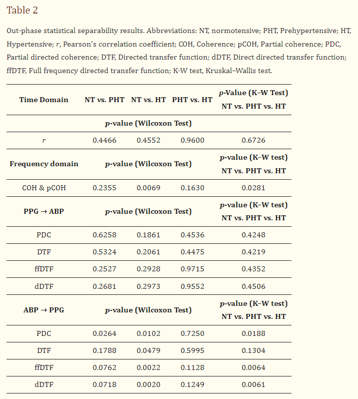
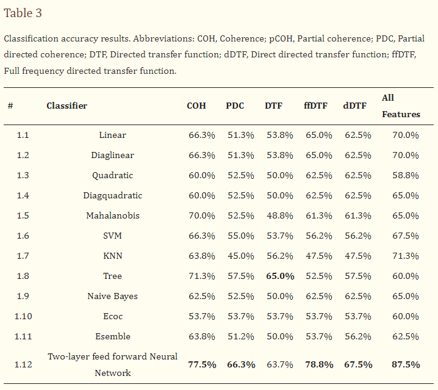

## Paper Review
<b>Title : </b> <u>Can Photoplethysmography Replace Arterial Blood Pressure in the Assessment of Blood Pressure?</u> [[Paper]](https://doi.org/10.3390/jcm7100316)
 
<b>Authors : </b> Gloria Martínez, Newton Howard, Derek Abbott Kenneth Lim, Rabab Ward, Mohamed Elgendi
 
<b>Publication : </b> Oct 7, 2018
 
<b>Read date : </b>: June, 17, 2022

## Abstract
#### Object 
This paper focuses on analyzing the similarities in time and frequency domains between ABP and PPG signals.

#### Result:
- The correlation coefficient was r>0.9 on average for all groups, indicating a strong morphology similarity. 
- For COH and pCOH, coherence (linear correlation in frequency domain) was found with significance (p < 0.01) in differentiating between normotensive and hypertensive subjects using PPG signals. 

#### Note:
- From a database with 120 records of ABP and PPG, each 120 s in length, the records where separated into epochs taking into account 10 heartbeat.

## 1. Introduction
- Cardiovascular diseases (CVD) have been a major cause of mortality and morbidity around the world.
- There are two types of methodologies for BP monitoring: invasive and noninvasive. But in case of invasive methods, there are some limitation on cost-expensive as well as exceptional case. Some patients cannot use the invasive method.
- Therefore, a method of non-invasive continuous blood pressure monitoring is valuable clinically.
- PPG has wide potential in clinical applications due to its simplicity and noninvasiveness. Recently, it has been considered as a potential alternative to cuff-based BP monitors.
-<b>Since the ABP and PPG signals have the same source of excitation (heart), it is logical to expect a similarity between the signals in both time and frequency</b>

## 2. Materials and Methods
#### (1) Dataset
- Physionet's MIMIC II dataset (Multi-parameter Intelligent Monitoring in Intensive Care) in the UCI Machine Learning Repository. (https://archive.ics.uci.edu/ml/datasets/Cuff-Less+Blood+Pressure+Estimation)
- Both PPG and ABP signals are 125Hz, 120s in length.

#### (2) Preproscessing
- Three groups were formed: 
    - Normal (less than 120 mmHg; n=43)
    - Prehypertensive (120–139 mmHg; n=40)
    - Hypertensive (140 mmHg or higher; n=37)

#### (3) Hypotheses
- H1: <b>If the PPG amplitude is correlated with the ABP amplitude</b>, then the PPG amplitude can replace ABP for measuring BP.
- H2: <b>If the PPG morphology is correlated with the ABP morphology</b>, then the PPG waveform morphology holds valuable information that can be used for evaluating BP.
- H3:<b> If the PPG waveform and the ABP have mutual information and coherence</b>, then the PPG waveform morphology holds valuable information that can be used for evaluating BP.

#### (4) Methods
- In-Phase Analysis
- Out-Phase Analysis
- Statistical Analysis
- Classification Analysis

## 3. Verfication
- H1: As looking over the image below, The amplitudes of PPG waveforms and their corresponding ABP waveforms are not correlated. Therefore, the outcome of this analysis rejected the H1 hypothesis, and <b>PPG amplitudes cannot replace ABP amplitudes.</b> 

 

- H2: As looking over the image below, in overall, the correlation coefficient r>0.9 was obtained, and therefore this result suggest acceptance of H2 hypothesis. <b>This implies that both signals had a high similarity in their morphology; </b> 

 

- H3: COH and pCOH scored the exact p-values for all comparisons, with a significant difference (p=0.0069) in comparing NT vs. HT groups, this result suggest acceptance of the H3 hypothesis.  

- Additional classification: This implies that the two groups (NT and HT) can be differentiated even when the similarity-causality between the signals is high in all groups.  

 

## 4. Result
#### (1) Limitation
- lack of clinic data

#### (2) Research Result
- It can be concluded that there is a similarity between the PPG and ABP morphologies. 

 

---

##### Unknown words in the paper
- normotensive : 정상 혈압