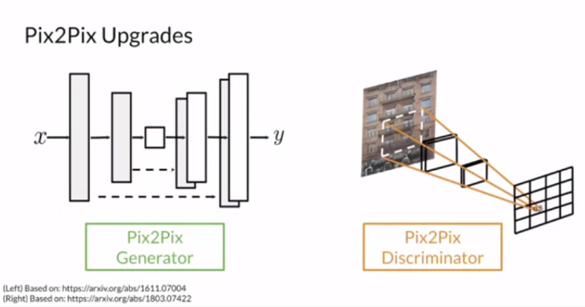
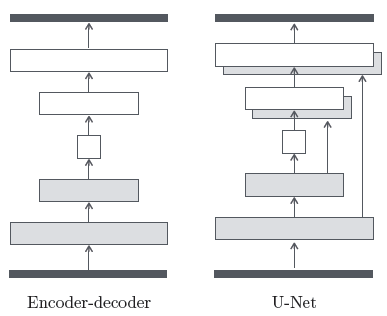
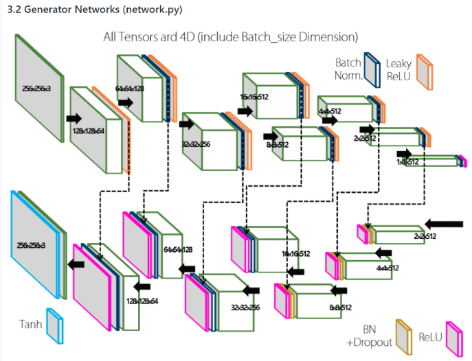
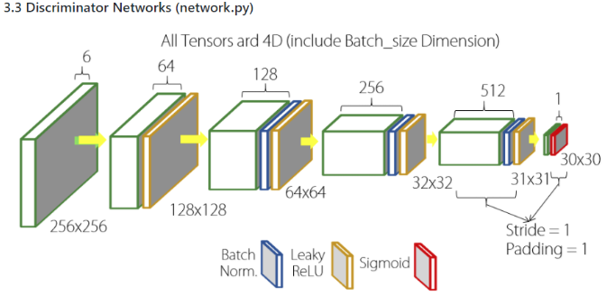

## Paper Review
<b>Title : </b> <u> Pix2Pix - Image-to-Image Translation with Conditional Adversarial Networks</u> [[Paper]](https://arxiv.org/pdf/1406.2661.pdf)
<br>
<b>Authors : </b>  Phillip Isola, Jun-Yan Zhu, Tinghui Zhou, Alexei A Efros
<br>
<b>Publication : </b> 2018
<br>
<b>Read date : </b>: July, 04, 2022

# Pix2Pix

 <br/>
The biggest important thing is that Pix2Pix is the one of the image translation model. Pix2Pix has developed the general generator and discriminator. The authors use a U-Net structure with skip-connection as Generators, and they uses a convolutional PathGAN classifier, which only penalizes structure at the scale of image patches as Discriminators.

## Generator - U-net

 <br/>

Basically, U-net is an encoder-decoder with skip-connection between mirrored layers in the encoder and decoder stack. In general, when the data goes through the Encoder, the features of the image can be extracted well. Then, using Decoder, you can get desired image. However, in this process, loss of information, including image shape and resolution is inevitable. To prevent this loss of information, skip-connection is used. Skip-connection is good to solve the vanishing gradient problem in the backpropagation. <br/>

 <br/>

#### Structure of Skip-connection
```python
def __init__(self, image_channels=3, inner_channels=64, n_layers=8, dropout=0.5, norm_layer=nn.InstanceNorm2d):
        super().__init__()
        assert n_layers >= 5

        block = UNetSkipConnectionBlock(inner_channels*8, inner_channels*8, 'innermost', norm_layer=norm_layer)
        for _ in range(n_layers-5):
            block = UNetSkipConnectionBlock(inner_channels*8, inner_channels*8, 'middle', block, dropout, norm_layer=norm_layer)
        block = UNetSkipConnectionBlock(inner_channels*4, inner_channels*8, 'middle', block, dropout, norm_layer=norm_layer)
        block = UNetSkipConnectionBlock(inner_channels*2, inner_channels*4, 'middle', block, dropout, norm_layer=norm_layer)
        block = UNetSkipConnectionBlock(inner_channels, inner_channels*2, 'middle', block, dropout, norm_layer=norm_layer)
        self.model = UNetSkipConnectionBlock(image_channels, inner_channels, 'outermost', block)

    def forward(self, x):
        return self.model(x)
```

#### Structure of Generator
```python
def __init__(self,
                 outer_channels,
                 inner_channels,
                 module_type,
                 submodule=None,
                 dropout=0.5,
                 norm_layer=nn.InstanceNorm2d
                 ):
        super().__init__()
        
        if module_type not in ['innermost', 'outermost', 'middle']:
            raise Exception('no such module type')

        if type(norm_layer) == functools.partial:
            use_bias = norm_layer.func == nn.InstanceNorm2d
        else:
            use_bias = norm_layer == nn.InstanceNorm2d
        
        down_conv = nn.Conv2d(outer_channels, inner_channels, kernel_size=4, stride=2, padding=1, bias=use_bias)
        down_relu = nn.LeakyReLU(0.2, True)
        down_norm = norm_layer(inner_channels)

        up_relu = nn.ReLU(True)
        up_norm = norm_layer(outer_channels)

        self.outermost = module_type == 'outermost'
        if module_type == 'innermost':
            up_conv = nn.ConvTranspose2d(inner_channels, outer_channels, kernel_size=4, stride=2, padding=1, bias=use_bias)
            modules = [down_relu, down_conv, up_relu, up_conv, up_norm]
        elif module_type == 'outermost':
            up_conv = nn.ConvTranspose2d(inner_channels*2, outer_channels, kernel_size=4, stride=2, padding=1)
            modules = [down_conv, submodule, up_relu, up_conv, nn.Tanh()]
        else:
            up_conv = nn.ConvTranspose2d(inner_channels*2, outer_channels, kernel_size=4, stride=2, padding=1, bias=use_bias)
            modules = [down_relu, down_conv, down_norm, submodule, up_relu, up_conv, up_norm, nn.Dropout(dropout)]

        self. model = nn.Sequential(*modules)

    def forward(self, x):
        if self.outermost:
            return self.model(x)
        return torch.cat([x, self.model(x)], 1)
```

<br/><br/>

## Discriminator - PathGAN

 <br/>

The discriminator for pix2pix is PatchGAN. The original GANs' discriminator looks at the whole image to determine whether the image is real or fake. On the other hand, PathGAN restrict our attention to the structure in local image patches. Therefore, we can say PatchGAN only penalizes structure at the scale of patches. This discriminator tries to classify if each N ×N patch in an image is real or fake.

At that time, the patch size is usually 70 x 70. The reason is that even if you can use a patch of 286 x 286 size, the result is the same as the image size. Also, it takes more time to train, increasing parameters.

```python
 def __init__(self,
                 input_channels=6,
                 inner_channels=64,
                 n_layers=3,
                 norm_layer=nn.InstanceNorm2d
                 ):
        super().__init__()

        if type(norm_layer) == functools.partial:
            use_bias = norm_layer.func == nn.InstanceNorm2d
        else:
            use_bias = norm_layer == nn.InstanceNorm2d

        modules = [nn.Conv2d(input_channels, inner_channels, kernel_size=4, stride=2, padding=1), nn.LeakyReLU(0.2, True)]
        for i in range(n_layers-1):
            modules += [
                nn.Conv2d(inner_channels*min(2**i, 8), inner_channels*min(2**(i+1), 8), kernel_size=4, stride=2, padding=1, bias=use_bias),
                norm_layer(inner_channels*min(2**(i+1), 8)),
                nn.LeakyReLU(0.2, True)
            ]
        modules += [
            nn.Conv2d(inner_channels * min(2 ** (n_layers-1), 8), inner_channels * min(2 ** n_layers, 8), kernel_size=4, stride=1,
                      padding=1, bias=use_bias),
            norm_layer(inner_channels * min(2 ** n_layers, 8)),
            nn.LeakyReLU(0.2, True),
            nn.Conv2d(inner_channels * min(2 ** n_layers, 8), 1, kernel_size=4, stride=1, padding=1)
        ]
        self.model = nn.Sequential(*modules)

    def forward(self, x):
        return self.model(x)
```


## Discriminator - PathGAN
- Use minibatch SGD
- Apply Adam with learning rate of 0.0002, momentum β1 = 0.5, β2 = 0.999.


<br/>
<br/>
<br/>
<br/>

Reference 1: Original paper <br/>
Reference 2: https://velog.io/@tobigs-gm1/Image-to-Image-Translation