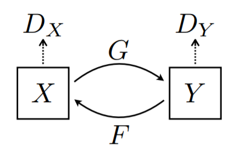
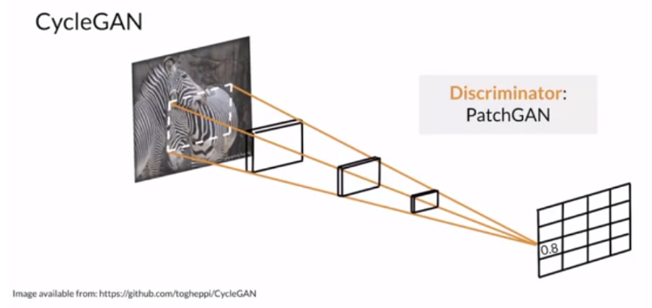
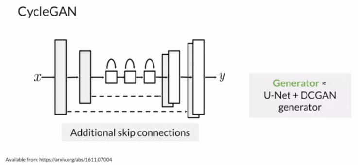
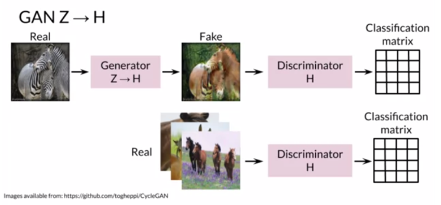
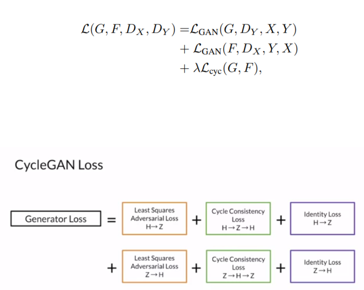
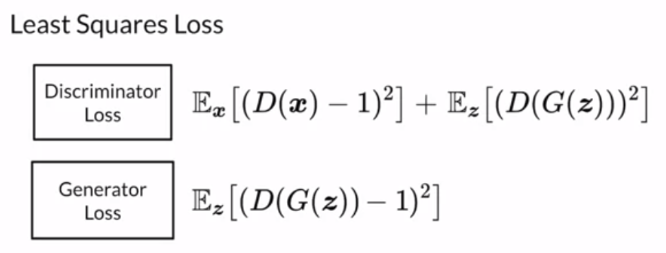

## Paper Review
<b>Title : </b> <u> CycleGAN - Unpaired Image-to-Image Translation using Cycle-Consistent Adversarial Networks</u> [[Paper]](https://arxiv.org/pdf/1703.10593.pdf)
<br>
<b>Authors : </b>  Jun-Yan Zhu, Taesung Park, Phillip Isola, and Alexei A. Efros
<br>
<b>Publication : </b> 2020
<br>
<b>Read date : </b>: July, 04, 2022

# CycleGAN

The pix2pix model was trained with a paired image dataset. However, paired datasets are actually very difficult to obtain, and even if they are obtained, the cost of the dataset is so expensive. So, the authors of the paper present CycleGAN, which is a method to replace images obtained from domain X into target domain Y without paired examples.

In the case of paired dataset, it contains information about how the coordinate values of the X image and the coordinate values of the Y image correspond. However, there is no information about the unpaired dataset because it is not a one-to-one match. To improve this, the authors used the cycle consistency loss function.


## 1. Structure of CycleGAN
 <br/>

By default, CycleGAN requires 2 GANs. A generator that creates an image from X to Y, a discriminator that determines whether this image is real, and vice versa.

## 2. Generator 

<B>U-net structure with DCGAN and residual connection is used as a Generator.</B> Also, GANs basically goes through <i>Downsampling</i> and <i>Upsampling</i> process in Generator. <B>Downsampling</B> is used to extract the characteristics of the input image. <B>Upsampling</B> is to translate the style of the image. In the image, each is done using <code>Conv2d</code> and <code>ConvTranspose2d</code>.


## 3. Discriminator - PatchGAN

 <br/>
 <br/>

PatchGAN is used as a Discriminator. By doing this, it reduces the loss of information, making high-resolution processing easier.

```python
    if netG == 'resnet_9blocks':
        net = ResnetGenerator(input_nc, output_nc, ngf, norm_layer=norm_layer, use_dropout=use_dropout, n_blocks=9)
    elif netG == 'resnet_6blocks':
                net = ResnetGenerator(input_nc, output_nc, ngf, norm_layer=norm_layer, use_dropout=use_dropout, n_blocks=6)
    elif netG == 'unet_128':
        net = UnetGenerator(input_nc, output_nc, 7, ngf, norm_layer=norm_layer, use_dropout=use_dropout)
    elif netG == 'unet_256':
        net = UnetGenerator(input_nc, output_nc, 8, ngf, norm_layer=norm_layer, use_dropout=use_dropout)
    else:
        raise NotImplementedError('Generator model name [%s] is not recognized' % netG)
    return init_net(net, init_type, init_gain, gpu_ids)
```

In general, when the real image goes through the generator, it creates a fake image. At this time, the discriminator determines whether this image is real or fake based on the data it has learned. Since patchGAN is used, the output is obtained by determining whether each part is real or not, as shown in the figure. <br/>
 <br/>


## 3. Loss Function
- Cycle Loss : L1 Loss
- GAN Loss (LSGAN) : MSE Loss
- Identity Loss : L1 Loss


1. <b>Cycle Consistency loss </b><br>
Cycle consistency loss compares an input photo to the Cycle GAN to the generated photo and calculates the difference between the two, e.g. using the L1 norm or summed absolute difference in pixel values.

Since CycleGAN use an unpaired dataset, we need to use Cycle Consistency. In terms of a paired dataset, we have the coordinates of the image in X and Y, so we have information about this relationship. On the other hand, the unpaired dataset does not have this information. In other words, it means that there are few restrictions on mapping, which can eventually cause mode collapse. To prevent this, cycle consistency is used.<br> 
 <br> 

<br> 

2. <b>Adversarial Loss </b><br> 
Unlike the general GAN model, CycleGAN use Least Square loss instead of GCE loss. <br> 
 <br> 

3. <b>Identity Loss</b>
This loss can regularize the generator to be near an identity mapping when real samples of the target domain are provided.


## 4. Hyperparameter
- Activation: LeakyReLU
- Optimizer: Adam
- Normalization: Instance Normalization
- Model: Weight Initialize with Normal Distribution  - this is for preventing exploding gradients and vanishing gradients. You can use it with <code>torch.nn.init.normal_</code> => It makes mean value as 0 and std value as 0.02.


<br/>
<br/>
<br/>

Reference 1: https://medium.com/humanscape-tech/ml-practice-cyclegan-f9153ef72297 <br/>
Reference 2: https://github.com/aitorzip/PyTorch-CycleGAN <br/>
Reference 3: https://bo-10000.tistory.com/59