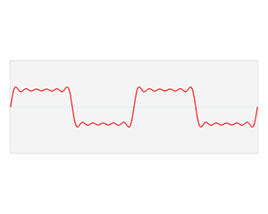
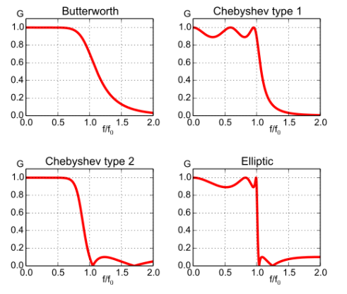

# Signal Processing

In order to use signals for the deep-learning, we need to do preprocessing the signals. Basically, in signal processing, filters are necessary to set the frequency band. There are two types of filters. One is <code>Bandpass Filter</code> and the other is <code>Notch Filter(=band-stop filter)</code>. Before we start to learn the filters, learn about <code>Fast Fourier Transform</code> first.  

 

## 1. Fast Fourier Transform 
FFT stands for Fast Fourier Transform. This is a method to analyze a signal from a different perspective by transforming a signal expressed in the time domain into the frequency domain. If you want to perform Fourier transform in Python, you can use the <code>np.fft.fft( )</code> function as follows.
  
The picture above is from the FFT article on Wikipidea. As you can see, he complex-looking signal in red can be described by multiple trigonometric (삼각함수) waveforms.

 

## 2. Bandpass Filter
<b>The goal of Band-pass filter is to select only a part of the frequency band. </b> A <code>low-pass filter</code> passes only the value lower than the criteria value. On the other hand, a <code>high-pass filter</code> passes only the greater than criteria value. A <code>band-pass filter</code> passes only certain area. All filters have different methods of handling the boundary value when passing the frequency value, but the most general method is butterworth type. When only [200-300] is passed, the boundary values are around 200 and 300.  

 
When cutting frequencies using f/fo 1.0 as the cut-off criterion, it can be seen that Butterworth cuts more smoothly than Cyebyshev or Elliptic. The slower you cut, the more natural the cut. 

#### (1) Band-pass Filter
A band-pass filter can extract only a partial range of frequency bands.

#### (2) Low-pass Filter
A low-pass filter only passes frequencies lower than the selected cutoff frequency.

#### (3) High-pass Filter
A high-pass filter only passes frequencies higher than the selected cutoff frequency.

## 3. Notch filter (Band-stop filter)
As opposed to a bandpass filter, a notch filter is a band-stop filter with a narrow bandwidth (high quality factor). It rejects a narrow frequency band and leaves the rest of the spectrum little changed. [[reference]](https://docs.scipy.org/doc/scipy/reference/generated/scipy.signal.iirnotch.html)

#### What is different between a bandpass and notch filter?
The main difference between a bandpass and notch filter is that a bandpass filter allows signals within a particular frequency range to pass and a notch filter will filter those signals out in that one frequency range.  

## 4. Savitzky-Golay filter
The purpose of the [Savitzky-Golay filter](https://en.wikipedia.org/wiki/Savitzky%E2%80%93Golay_filter) is to make the wave more smooth.  

